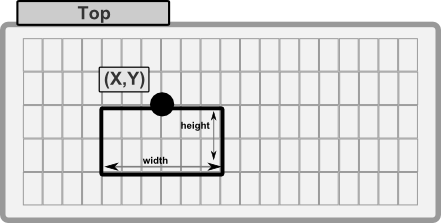
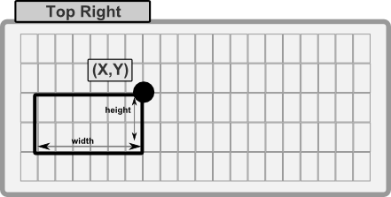
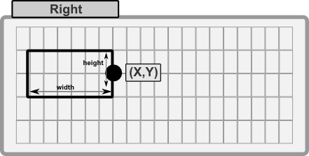
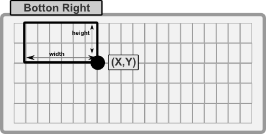
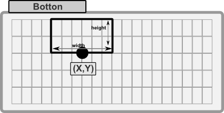
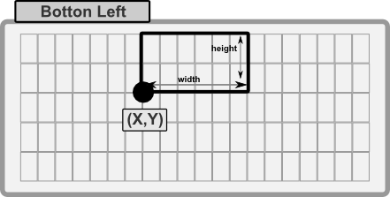
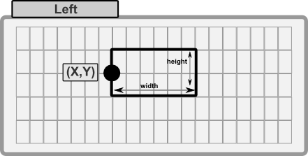
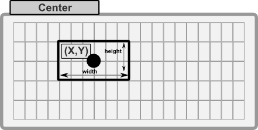

# Rectangles

Rectangles are the most basic shape you can draw on a surface. They are defined by a position and a size. The position is the top-left corner of the rectangle, and the size is the width and height of the rectangle.

In AppCUI a rectangle is defined based on the following structure:

```rust
#[derive(Copy, Clone, Debug)]
pub struct Rect {
    left: i32,
    top: i32,
    right: i32,
    bottom: i32,
}
```

A rectangle can be created using the following methods:
1. `Rect::new(left, top, right, bottom)` - creates a new rectangle based on the provided coordinates.
2. `Rect::with_size(left, top, width, height)` - creates a new rectangle based on the provided position and size.
3. `Rect::with_alignament(x, y, width, height, align)` - creates a new rectangle based on the provided position, size and alignment.
4. `Rect::with_point_and_size(point, size)` - creates a new rectangle based on the provided point and size. 

The alignament in the third method is defined as follows:

```rust
#[repr(u8)]
#[derive(Copy, Clone, PartialEq, Debug)]
pub enum Alignament {
    TopLeft = 0,
    Top,
    TopRight,
    Right,
    BottomRight,
    Bottom,
    BottomLeft,
    Left,
    Center,
}
```

| Alignament    | Decription                                                | Preview                                   |
| ------------- | --------------------------------------------------------- | ----------------------------------------- |
| `TopLeft`     | (X,Y) represents the top-left corner of the rectangle     |          |
| `Top`         | (X,Y) represents the top-center of the rectangle          |                   |
| `TopRight`    | (X,Y) represents the top-right corner of the rectangle    |        |
| `Right`       | (X,Y) represents the right-center of the rectangle        |               |
| `BottomRight` | (X,Y) represents the bottom-right corner of the rectangle |  |
| `Bottom`      | (X,Y) represents the bottom-center of the rectangle       |             |
| `BottomLeft`  | (X,Y) represents the bottom-left corner of the rectangle  |    |
| `Left`        | (X,Y) represents the left-center of the rectangle         |                 |
| `Center`      | (X,Y) represents the center of the rectangle              |             |


To draw a rectangle on a surface, you can use the following methods:

| Method           | Description                                                                                           |
| ---------------- | ----------------------------------------------------------------------------------------------------- |
| `draw_rect(...)` | Draws a rectangle on the surface by providing a `Rect` object, a line type and a character attribute. |
| `fill_rect(...)` | Fills a rectangle on the surface by providing a `Rect` object and a character attribute.              |

Example:

```rust
use appcui::graphics::*;

let mut surface = Surface::new(100, 50);
let r = Rect::new(10, 10, 20, 20);
// fill the rectangel with spaces (dark blue background)
surface.fill_rect(r, Character::new(' ', Color::White, Color::DarkBlue, CharFlags::None));
// draw a border around the rectangle (white on black)
surface.draw_rect(r, LineType::Single, CharAttribute::with_color(Color::White, Color::Black));
```